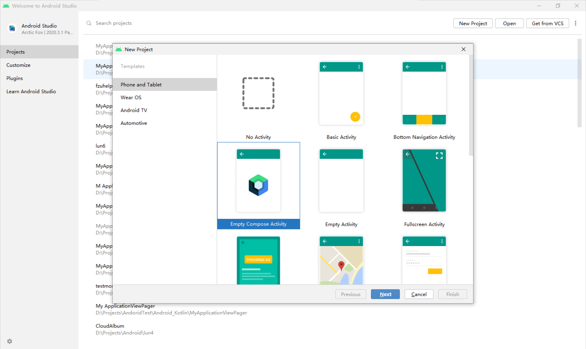
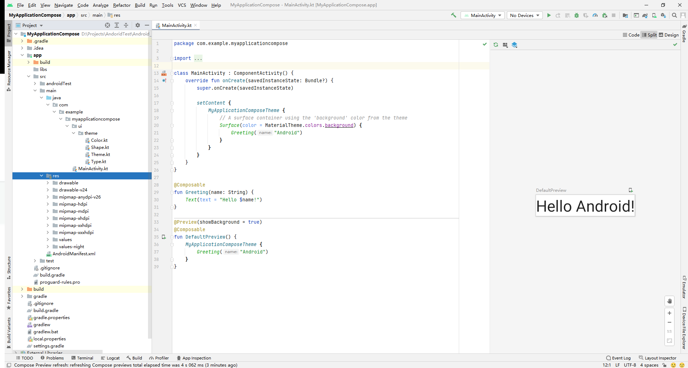

# Android Compose 学习笔记（一)

#### 目录：

1. 关于compose
2. 开始使用
3. 常用控件的使用


## 一、关于compose

Jetpack Compose 是用于构建原生Android界面的新工具包。使用更少的代码、强大的工具和直观的Kitlin API，可以简化并加快Android界面开发。Compose围绕可组合函数构建，放弃了原有使用xml的方式编写UI，没有view类的概念，用声明式的函数构建UI


## 二、开始使用

#### 1、创建一个Compose项目

使用Compose首先需要更新[Android Studio Arctic Fox](https://developer.android.google.cn/studio)版本，更新完成后就可以在New Project中看到Compose项目。

选择Empty Compose Activity，compose最低支持API21，这里选择使用API24，点击finish完成项目创建。

可以看到，项目结构发生了改变，res包下的xml资源文件变成了kt代码文件。Activity界面多了个预览窗口。



到这里新Compose项目就创建完成了。

#### 2.在现有项目中引入Compose

同样的需要更新Android Studio为Arctic Fox或更新版本，然后需要配置一些设置和依赖

- **gradle 配置 ** app目录下的`build.gradle`添加如下代码：

```kotlin
android {
    defaultConfig {
        ...
        minSdkVersion 21
    }
    buildFeatures {
        // Enables Jetpack Compose for this module
        compose true
    }
    
    ...
    // Set both the Java and Kotlin compilers to target Java 8.
    
    compileOptions {
        sourceCompatibility JavaVersion.VERSION_1_8
        targetCompatibility JavaVersion.VERSION_1_8
    }
    
    kotlinOptions {
        jvmTarget = "1.8"
    }
}
```

- **Kotlin-Gradle 插件** 根目录下的`build.gradle`添加如下代码：

```kotlin
buildscript {
    repositories {
        google()
        jcenter()
        // To download the required version of the Kotlin-Gradle plugin,
        // add the following repository.
        maven { url 'https://dl.bintray.com/kotlin/kotlin-eap' }
        ...

        dependencies {
            classpath 'com.android.tools.build:gradle:4.0.0-alpha01'
            classpath 'org.jetbrains.kotlin:kotlin-gradle-plugin:1.3.60-eap-25'
        }
    }
    
    allprojects {
        repositories {
            google()
            jcenter()
            maven { url 'https://dl.bintray.com/kotlin/kotlin-eap' }
        }
        
    }

```

- **Jetpack Compose工具包依赖项**  app目录下的`build.gradle`：

```kotlin
dependencies {
    // You also need to include the following Compose toolkit dependencies.
    implementation 'androidx.ui:ui-tooling:0.1.0-dev02'
    implementation 'androidx.ui:ui-layout:0.1.0-dev02'
    implementation 'androidx.ui:ui-material:0.1.0-dev02'
    ...
}

```
相比之下还是直接创建新项目方便

#### 3.看一下模板的代码

先把看不懂的代码删掉，留下主体。可以看到，`Greeting`、`DefaultPreview`两个方法用了`@Compose`注解，说明这是个Compose函数，`Greeting`方法接受一个字符串传给Compose库的`Text`函数用来显示文字，`@Preview`注解的`DefaultPreview`方法用来预览UI

```kotlin
class MainActivity : ComponentActivity() {
    override fun onCreate(savedInstanceState: Bundle?) {
        super.onCreate(savedInstanceState)
        setContent {
            Greeting("Android")
        }
    }
}

@Composable
fun Greeting(name: String) {
    Text(text = "Hello $name!")
}

@Preview
@Composable
fun DefaultPreview() {
    Greetinfag("Android")
}
```

启动看看，经典Hello Android


## 三、常用控件的使用


### 1、显示文字

使用`Text`即可显示文字,如想改变显示效果,则需要给`Text`添加其他参数，下面是一些常用文字显示控制操作


##### 1）改变颜色，设置`color`参数即可

```kotlin
Text(text = "Hello Android!", color = Color.Blue)
```


### 2、显示图片

将图片放入资源文件夹，使用`DrawImage`来显示图片

```kotlin
Image(
        painter = painterResource(id = R.drawable.pic),
        contentDescription = null
    )
```

.jpg)


### 3、按钮

使用`Button`来显示一个按钮，在`onclick`中传入`lambda`参数设置点击事件,并用`Text`设置按钮的显示内容

```
Button(onClick = { /*TODO*/ }) {
        Text(text = "Button")
    }
```


### 4、多行显示

想要显示多行内容,如果只是多次调用函数UI则会重叠,像这样


可用`Column`来实现多行显示，类似`LinearLayoutd`的垂直分布，多列显示用`Row`,这样就能显示多个内容了


### 时间匆忙来不及写的更详细，大家有兴趣可以查询官方文档继续学习https://developer.android.google.cn/courses/pathways/compose#0
